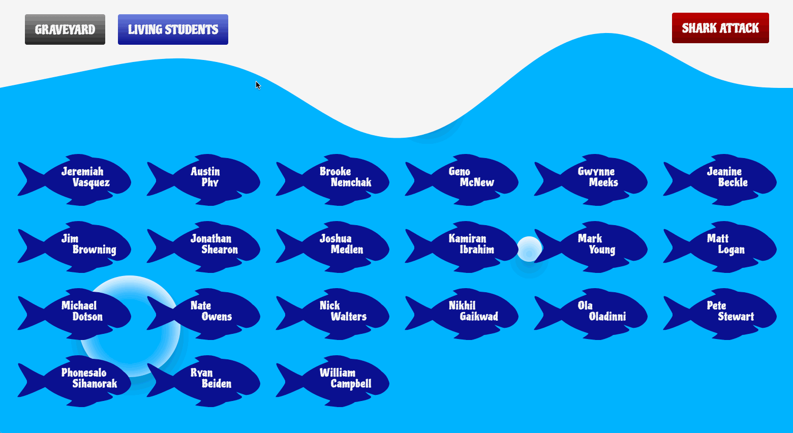

# Shark Attack

This project is simple in that you have a a list of students here at NSS in the form of fishes! If you select the `Shark Attack` button, then the student will be moved to the Graveyard page.

This is my first React App, and it uses `Class` Components as well as `React Router`.

## Preview

## Clone the Repository
- Clone it 👉🏼 `$ git clone https://github.com/RyanBeiden/shark-attack.git`

- Install the dependencies 👉🏼 `$ npm install`

- Run `$ npm start`

## Technologies Used
  
